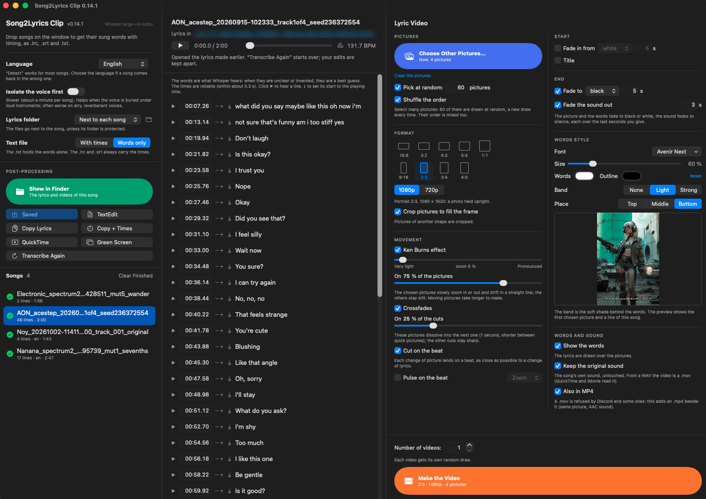

# Song2Lyrics Clip — drop a song, get its lyrics with timing, and a clip, on your Mac

**A small native Mac app that writes down the sung words of a song with their timing (`.lrc`, `.srt`, `.txt`), and turns the song into a lyric video: one picture or a hundred, cut where the lyrics change and on the beat.**

Drop a WAV or an MP3 on the window: a few seconds later the lyrics are there,
one line per row, each with its start time. Listen, fix a word, save. Then
choose a folder of pictures, a format from 16:9 to TikTok's 9:16, and make a
clip. Everything runs on your Mac: no account, no upload.



*Settings and songs on the left, the timed lyrics in the middle, the clip maker on the right.*

> Song2Lyrics Clip listens with **[whisper.cpp](https://github.com/ggml-org/whisper.cpp)** and OpenAI's
> **Whisper large-v3-turbo** model. It is not made by or affiliated with either. It does not include the model:
> you download it once (1.6 GB, see [Requirements](#-requirements)).

**[⬇️ Download the app →](https://github.com/Quick-Eyed-Sky/song2lyrics-clip/releases/latest)**
· **[Full user guide →](docs/USER_GUIDE.md)**
· **[Why macOS asks you to confirm before opening it →](docs/macos-security.md)**

---

## ✨ What it does

**The lyrics**

- **Drop one song, several, or a whole folder** (WAV, MP3, FLAC, M4A, AIFF) on
  the window or on the app's icon. Songs are transcribed one after the other,
  about **5 seconds each** on an idle Mac (Apple Silicon graphics, measured on
  an M4).
- **Timing you can trust.** Word times come from the model itself (DTW), and
  lines are rebuilt from them: on the test song, line starts land 0.1 to
  0.6 s from those of a dedicated karaoke tool.
- **Made for music, not speech.** Whisper is set so that it does not start
  repeating one sentence over the instruments (a classic failure on songs), and
  lines like "Thank you." or "[Music]", which it writes when nobody sings, are
  dropped.
- **Check by ear, fix in place.** ▶ plays from any line; the line being sung is
  highlighted. Retype a word, type a new time, nudge it by 0.1 s, or set it to
  the moment playing with one click. ⌘S saves.
- **Your corrections are never overwritten.** Transcribe an edited song again
  and the new version goes to separate `.whisper.*` files.
- **Three files per song**: `.lrc` (VLC, music players, karaoke apps), `.srt`
  (subtitles, video editors), `.txt` (with or without times), plus the time of
  every single word in a `.json`.

**The clip**

- **One picture or many.** They follow the **order of their file names**
  (`1-`, `2-`… prepare a story), or a **random order**. Select 200 pictures and
  let the app **pick 50 at random**, a new draw each time: make five versions
  in one click and keep the one that surprises you.
- **Cuts that follow the song.** Pictures are spread over the song, then each
  cut moves to the nearest **change of lyric line**, and onto the **beat**.
- **Tempo detection** built in (tested on ten songs of known tempo: all within
  2 %, most exactly).
- **Ken Burns** on a share of the pictures (slow zoom and a straight, steady
  drift), **crossfades** on a share of the cuts.
- **Nine formats**, from 16:9 through 3:2, 4:3, 5:4 and 1:1 to 4:5, 3:4, 2:3
  and 9:16 for TikTok, Reels and Shorts, in **1080p or 720p**. Pictures cropped
  to fill the frame, or shown whole with black bars.
- **A pulse on the beat**: a short zoom or flash on every beat, every second
  beat or every bar, at the strength you choose.
- **An opening and an ending**: a fade in from black or white, a title (and a
  smaller second line) that arrives after the delay you give, a fade out to
  black or white, and the sound fading to silence.
- **Your own style for the words**: ten fonts chosen to stay readable over
  pictures (or any font of your Mac), size, colour, outline colour, a dark band
  behind them or none, at the bottom, in the middle or at the top, with a live
  preview on your own picture.
- **With or without the words**, to finish the montage yourself in iMovie.
- **The song's original sound**, untouched, or AAC in an `.mp4` for Discord and
  the web (or both).
- **Instrumentals too**: no lyrics, still a clip.
- **Nothing is irreproducible.** Every video gets a `.txt` beside it with every
  setting, the random seed, and the start time of each picture.

**Also**: a QuickTime video with the lyrics as subtitles (to check the timing),
and an iMovie green-screen overlay (white words on green, to lay over your own
footage).

## ⚠️ Worth knowing before you start

**The words are what Whisper hears.** On clear singing they are usually right.
On AI-generated songs that sing invented syllables, they are a best guess
(other tools guess almost the same thing). The **timing** is the reliable part.
Every line can be corrected in the app.

**The clip maker draws every frame itself**, for smooth Ken Burns movement and
clean crossfades. A two-minute clip of still pictures takes about 15 seconds;
with every picture moving, about a minute and a half.

---

## 💻 Requirements

- A Mac with **Apple Silicon** (M1 or later) — the app is built for it only.
- **macOS 14 (Sonoma) or later** — the declared target. It has only been run
  and tested on macOS 26.
- Free tools that do the heavy lifting, installed once:

| Tool | Why | How |
|---|---|---|
| [Homebrew](https://brew.sh) | installs the two tools below | see brew.sh |
| **ffmpeg** | reads every audio format, writes the videos | `brew install ffmpeg` |
| **whisper.cpp** | the speech recognition, on the Mac's graphics chip | `brew install whisper.cpp` |
| **Whisper large-v3-turbo** (1.6 GB) | the model whisper.cpp runs | the two lines below |
| **numpy and Pillow** for Python 3 | draw the video frames, measure the tempo | `/usr/bin/python3 -m pip install --user numpy pillow` |

```
mkdir -p ~/.cache/whisper.cpp
curl -L -o ~/.cache/whisper.cpp/ggml-large-v3-turbo.bin https://huggingface.co/ggerganov/whisper.cpp/resolve/main/ggml-large-v3-turbo.bin
```

The transcription alone needs only ffmpeg, whisper.cpp and the model. Without
numpy and Pillow, the app says so in the clip section and still does the
lyrics.

*Optional:* **Isolate the voice first** (separating the voice from the
instruments before listening, with a BS-Roformer model) appears when
[python-audio-separator](https://github.com/nomadkaraoke/python-audio-separator)
is installed (`audio-separator` on the path, or in `~/.local/bin`). It helps when
the voice is buried under loud instruments, and is often worse on airy,
reverberant voices.

## 📥 Get it — two ways

**1. Download the app** from the
**[Releases page](https://github.com/Quick-Eyed-Sky/song2lyrics-clip/releases/latest)**:
unzip, drag `Song2Lyrics Clip.app` to your Applications folder. **macOS will ask you to
confirm before it opens it the first time** — normal for an app that is not
signed with an Apple Developer ID; it says nothing about what the app does, and
**[this page explains exactly why and how to open it](docs/macos-security.md)**.

**2. Build it yourself, from the source in this repository** — and macOS will
not ask anything, because an app you build on your own Mac was never
"downloaded". You need Apple's command line tools (not the full Xcode):

```
xcode-select --install
```

then, in Terminal:

```
git clone https://github.com/Quick-Eyed-Sky/song2lyrics-clip.git
cd song2lyrics-clip/source
./build_app.sh
```

It takes a few seconds and puts `Song2Lyrics Clip.app` in the `song2lyrics-clip` folder.

---

## 🎛️ At a glance

| Where | What |
|---|---|
| **Left** | Language (detected, or forced), *Isolate the voice first*, where the lyrics go (Movies › Lyrics, next to each song, or a folder of your choice), the `.txt` with or without times. Then **post-processing**: a big **Show in Finder** button, Save, TextEdit, Copy (with or without times), the QuickTime and iMovie videos, *Transcribe Again*. Then the list of songs. |
| **Middle** | The selected song: a link to its folder, the player with its **tempo**, the timed lines to check and correct. |
| **Right** | The **Lyric Video** maker, in two halves: *Pictures*, *Format*, *Movement* / *Start*, *End*, *Words Style*, *Words and Sound*, with the **Make the Video** button always in sight at the bottom. |

Drag the wide handles between the columns to resize them.

Every setting is remembered from one launch to the next. The
**[user guide](docs/USER_GUIDE.md)** explains each one, where the cuts fall,
and gives tips (TikTok, square pictures, iMovie titles).

## 🔬 How it works

- **Listening**: whisper.cpp with *large-v3-turbo* on the graphics chip, with
  no text carried from one 30-second window to the next (without that, Whisper
  loops on music), and word times from the model's attention (DTW). Lines are
  rebuilt from the word times: a new line after `. ? !`, after a 3-second pause,
  or before 44 characters. No voice-activity detection: on a full mix it hears
  no speech, and on a vocal stem it shifts the word times.
- **Clips**: every frame is drawn with Pillow (sub-pixel movement, no jitter)
  and piped to ffmpeg (H.264).
- **Tempo**: where new sounds start (spectral flux), an autocorrelation for a
  first guess, then a fine search of the beat period and phase that best match
  the whole song.
- **The app** is SwiftUI; it runs the two Python scripts in `source/` and stops
  only the programs it started itself. It has **no network code**: once the
  model is downloaded, nothing leaves your Mac.

## 🧾 Limits

- **Steady tempo only** for the beat detection: songs that speed up or slow
  down get a single average tempo.
- **Lyrics in one language per song** (Whisper picks one).
- The words of AI songs with invented lyrics are a guess (see above).
- No signed or notarised build, hence the confirmation macOS asks for — see
  [the explanation](docs/macos-security.md).

---

## 📜 Licence and credits

**Song2Lyrics Clip is MIT** — see [LICENSE](LICENSE) and [NOTICE.md](NOTICE.md).

It runs, without including them: [whisper.cpp](https://github.com/ggml-org/whisper.cpp)
(MIT) and the [Whisper](https://github.com/openai/whisper) models (MIT),
[FFmpeg](https://ffmpeg.org) (LGPL / GPL), [numpy](https://numpy.org) (BSD) and
[Pillow](https://python-pillow.org) (HPND), and optionally
[python-audio-separator](https://github.com/nomadkaraoke/python-audio-separator) (MIT).

---

## 👋 Who made this

Jean-Pascal — **[Quick-Eyed Sky](https://www.youtube.com/@QuickEyedSky)** on
YouTube, [QES](https://huggingface.co/QES) on Hugging Face. Not a programmer:
this exists because I wanted the words of my AI songs, with their timing, and
clips that cut where the song does.

If it saved you an afternoon, you can
[buy me a coffee](https://buymeacoffee.com/oFJ5CiY7n). Entirely optional,
and the project stays exactly as free either way.

---

## 🙏 Thanks

To **Georgi Gerganov** and the whisper.cpp contributors, for making Whisper fast
on a Mac, and to **OpenAI**, for publishing the Whisper models under a licence
that lets anyone build on them.
